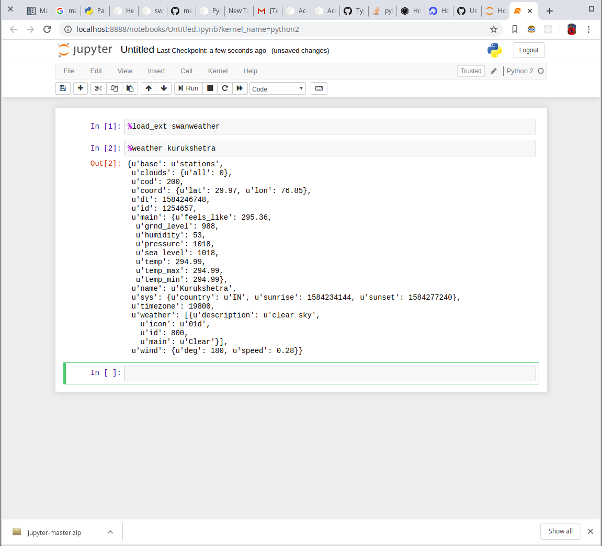
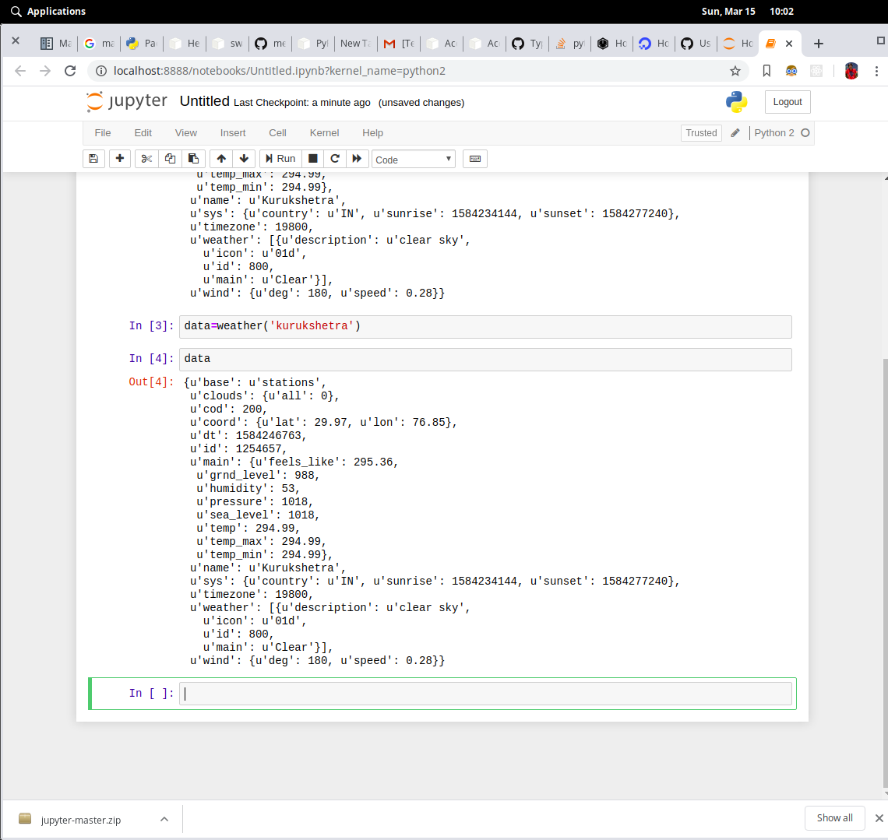

Extension published on pypi : https://test.pypi.org/project/swanweather/

Install Instuctions :
1) python3 -m pip install --index-url https://test.pypi.org/simple/ --no-deps swanweather

Using inside notebook :
1) load module 
    %load_ext swanweather

2) get weather 
    json directly %weather city_name

3) get weather and store in variable 
    data=weather('city_name')

screenshots : 

